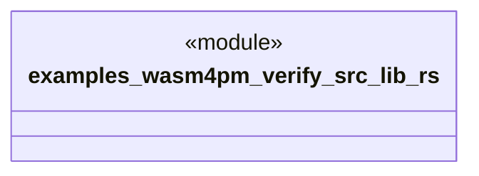

# `examples/wasm4pm-verify/src/lib.rs`

Source SHA-256: `7baf9f8929296f00db19acbe4c16429e0f50a56e3ec41ffa7febb6ba0ab71ed6`

## Dependencies

- None observed.

## Standing

- Structural parse: `ALIVE`
- Runtime behavior: `UNKNOWN`
