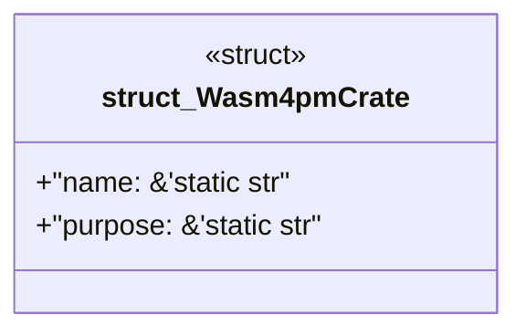

# `examples/wasm4pm-verify/src/wasm4pm_crate_catalog.rs`

Source SHA-256: `77ebd4e845e5eb274b81b5893571eac8857407dfc07038a46bd9d85efba7386d`

## Dependencies

- None observed.

## Standing

- Structural parse: `ALIVE`
- Runtime behavior: `UNKNOWN`
