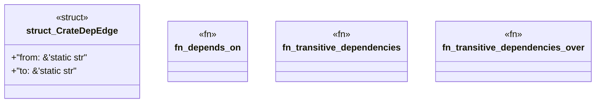

# `examples/wasm4pm-verify/src/wasm4pm_crate_deps.rs`

Source SHA-256: `b77932c70d435f08cf6497edccfd04c7e83263060925f8c77da4cd81b62479a0`

## Dependencies

- None observed.

## Standing

- Structural parse: `ALIVE`
- Runtime behavior: `UNKNOWN`
