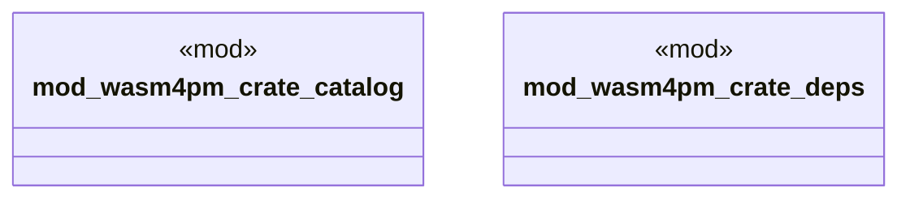

# `examples/wasm4pm-verify/src/wasm4pm_crate_lib_wiring.rs`

Source SHA-256: `abe9b757c58c46f70e87e5f26cc309d46d8f7a3becaede232ee30bd797ca0835`

## Dependencies

- None observed.

## Standing

- Structural parse: `ALIVE`
- Runtime behavior: `UNKNOWN`
