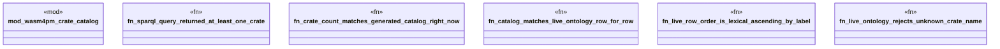

# `examples/wasm4pm-verify/tests/wasm4pm_crate_catalog_sparql_derived_proof.rs`

Source SHA-256: `80e2966b4e61fdb342a1bc02a5f493d452b611583b310bd5d981919724cc6e8d`

## Dependencies

- `wasm4pm_crate_catalog::{Wasm4pmCrate, WASM4PM_CRATES}`

## Standing

- Structural parse: `ALIVE`
- Runtime behavior: `UNKNOWN`
