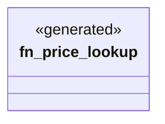

# `examples/zero-code-custom-handler-demo/src/custom_handlers.rs`

Source SHA-256: `069f1b60fe1fd436f83191d258e2756c2f506842d22d6735257478033d325c72`

## Dependencies

- `clap_noun_verb::Result`
- `serde_json::{Map, Value}`

## Standing

- Structural parse: `ALIVE`
- Runtime behavior: `UNKNOWN`
