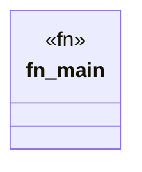

# `marketplace/packages/academic-bibliography-manager/tools/bibtex-parser.rs`

Source SHA-256: `574b33dfe65b97afab68df8c073f185e9b03ba97e2f5d355465042bfead7bd43`

## Dependencies

- `std::collections::HashSet`
- `std::env`
- `std::error::Error`
- `std::fs`

## Standing

- Structural parse: `ALIVE`
- Runtime behavior: `UNKNOWN`
