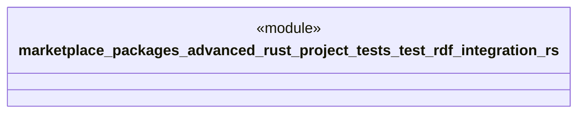

# `marketplace/packages/advanced-rust-project/tests/test_rdf_integration.rs`

Source SHA-256: `820a28b7349073502632f3aa48abb54a72e3fee754daa45ddfea27b4e98dadef`

## Dependencies

- `serde_json::json`
- `std::collections::HashMap`

## Standing

- Structural parse: `ALIVE`
- Runtime behavior: `UNKNOWN`
