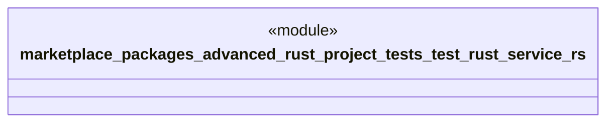

# `marketplace/packages/advanced-rust-project/tests/test_rust_service.rs`

Source SHA-256: `2480a0d5171367523eca64f8b5d20d712b2fd299607831085bbaf736d8b9355e`

## Dependencies

- `serde_json::json`
- `std::collections::HashMap`

## Standing

- Structural parse: `ALIVE`
- Runtime behavior: `UNKNOWN`
