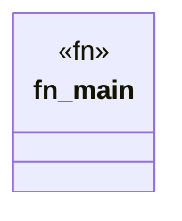

# `marketplace/packages/agent-cli-copilot/examples/basic.rs`

Source SHA-256: `19788f7d1cefd71bdf941d5be976febde278537de71c6453fa46f22b2892cd5d`

## Dependencies

- `anyhow::Result`

## Standing

- Structural parse: `ALIVE`
- Runtime behavior: `UNKNOWN`
