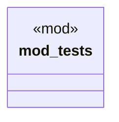

# `marketplace/packages/agent-cli-copilot/tests/integration_test.rs`

Source SHA-256: `db9748aa3838ec5a05019ca0bd4762004aced3842f5daf9a03f8d7fc1703c4a3`

## Dependencies

- `super::*`

## Standing

- Structural parse: `ALIVE`
- Runtime behavior: `UNKNOWN`
