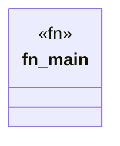

# `marketplace/packages/agent-context-crafter/examples/basic.rs`

Source SHA-256: `4c073cb327e14303faae867bf7bb0ebcc8c9cb53cbf7dc64ee728ee58b60a1a9`

## Dependencies

- `anyhow::Result`

## Standing

- Structural parse: `ALIVE`
- Runtime behavior: `UNKNOWN`
