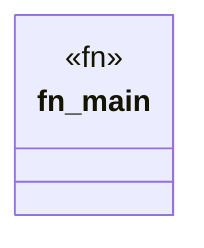

# `marketplace/packages/agent-editor/examples/basic.rs`

Source SHA-256: `304fc8a47db365870717c85d6e31b3a7793b5afd4e2a6aff66340f7102f5444f`

## Dependencies

- `anyhow::Result`

## Standing

- Structural parse: `ALIVE`
- Runtime behavior: `UNKNOWN`
