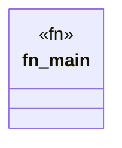

# `marketplace/packages/agent-memory-forge/examples/basic.rs`

Source SHA-256: `0341d4a85cf746460e4725331a1a7521b3aa37313cc5b111a9f6e09e97523716`

## Dependencies

- `anyhow::Result`

## Standing

- Structural parse: `ALIVE`
- Runtime behavior: `UNKNOWN`
