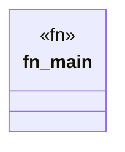

# `marketplace/packages/agent-reasoning-mcp/examples/basic.rs`

Source SHA-256: `9104e05878cac16a14e119a7ad978bb2c5c49ae45f82ce65edd3193f57a5d114`

## Dependencies

- `anyhow::Result`

## Standing

- Structural parse: `ALIVE`
- Runtime behavior: `UNKNOWN`
