# `marketplace/packages/ai-microservice/src/main.rs`

Source SHA-256: `d2efe06bd8a6b4d89c299043679dc11c76d3288450efeeb699d56d004a24cb7d`

```mermaid
classDiagram
    class struct_AppState {
      <<struct>>
      +"ai_client: Arc~dyn LlmClient~"
      +"template_gen: Arc~TemplateGenerator~"
      +"refactor_assistant: Arc~RefactorAssistant~"
      +"ontology_gen: Arc~OntologyGenerator~"
      +"cache: Arc~RwLock~Vec~CachedResponse~~~"
    }
    class struct_CachedResponse {
      <<struct>>
      +"prompt: String"
      +"response: String"
      +"timestamp: chrono::DateTime~chrono::Utc~"
    }
    class struct_CompletionRequest {
      <<struct>>
      +"prompt: String"
      +"stream: bool"
      +"temperature: Option~f32~"
    }
    class struct_CompletionResponse {
      <<struct>>
      +"content: String"
      +"tokens_used: Option~usize~"
      +"cached: bool"
    }
    class struct_TemplateRequest {
      <<struct>>
      +"description: String"
      +"language: String"
      +"variables: serde_json::Value"
    }
    class struct_TemplateResponse {
      <<struct>>
      +"template: String"
      +"variables: Vec~String~"
    }
    class struct_RefactorRequest {
      <<struct>>
      +"code: String"
      +"language: String"
      +"focus: Vec~String~"
    }
    class struct_RefactorResponse {
      <<struct>>
      +"refactored_code: String"
      +"suggestions: Vec~String~"
      +"metrics: RefactorMetrics"
    }
    class struct_RefactorMetrics {
      <<struct>>
      +"complexity_reduction: f32"
      +"readability_improvement: f32"
      +"performance_gain: f32"
    }
    class struct_OntologyRequest {
      <<struct>>
      +"domain: String"
      +"concepts: Vec~String~"
    }
    class struct_OntologyResponse {
      <<struct>>
      +"rdf_turtle: String"
      +"classes: Vec~String~"
      +"properties: Vec~String~"
    }
    class struct_AppError {
      <<struct>>
    }
    class fn_extract_variables {
      <<fn>>
    }
    note "From~E~ for AppError"
    note "IntoResponse for AppError"
```

## Dependencies

- `axum::{ extract::{Path, Query, State}, http::StatusCode, response::{IntoResponse, Response}, routing::{get, post}, Json, Router, }`
- `ggen_ai::{ GenAiClient, LlmClient, LlmConfig, LlmProvider, TemplateGenerator, RefactorAssistant, CacheConfig, OntologyGenerator, }`
- `serde::{Deserialize, Serialize}`
- `std::sync::Arc`
- `tokio::sync::RwLock`
- `tower_http::cors::CorsLayer`
- `tracing::{info, warn}`

## Standing

- Structural parse: `ALIVE`
- Runtime behavior: `UNKNOWN`
