# `marketplace/packages/api-gateway-service-mesh/src/rust/gateway.rs`

Source SHA-256: `c9cefcae6cbb13acb218726301dc1fdb58a790f471871cc23ecbabd26c8733a0`

```mermaid
classDiagram
    class struct_RouteConfig {
      <<struct>>
      +"path: String"
      +"method: String"
      +"backend_service: String"
      +"rate_limit_rps: Option~u32~"
      +"circuit_breaker: Option~CircuitBreakerConfig~"
      +"retry_policy: Option~RetryConfig~"
      +"timeout_seconds: u64"
    }
    class struct_CircuitBreakerConfig {
      <<struct>>
      +"failure_threshold: u32"
      +"timeout_seconds: u64"
      +"half_open_requests: u32"
    }
    class struct_RetryConfig {
      <<struct>>
      +"max_attempts: u32"
      +"backoff_multiplier: f64"
      +"initial_delay_ms: u64"
    }
    class struct_ServiceMeshConfig {
      <<struct>>
      +"mesh_type: String"
      +"mtls_mode: String"
      +"sidecar_port: u16"
      +"control_plane_endpoint: String"
    }
    class struct_GatewayState {
      <<struct>>
      +"routes: Arc~RwLock~Vec~RouteConfig~~~"
      +"mesh_config: Arc~ServiceMeshConfig~"
      +"health_checker: Arc~HealthChecker~"
      +"metrics: Arc~MetricsCollector~"
    }
    class struct_HealthChecker {
      <<struct>>
      +"interval_seconds: u64"
      +"failure_threshold: u32"
      +"success_threshold: u32"
    }
    class struct_MetricsCollector {
      <<struct>>
      +"request_counter: Arc~RwLock~u64~~"
      +"error_counter: Arc~RwLock~u64~~"
      +"latency_histogram: Arc~RwLock~Vec~u64~~~"
    }
    class fn_create_router {
      <<fn>>
    }
    class mod_tests {
      <<mod>>
    }
    note "GatewayState"
```

## Dependencies

- `axum::{ Router, Json, extract::{Path, State}, http::{StatusCode, HeaderMap}, middleware, }`
- `serde::{Deserialize, Serialize}`
- `std::sync::Arc`
- `super::*`
- `tokio::sync::RwLock`
- `tower::ServiceBuilder`
- `tower_http::{ trace::TraceLayer, compression::CompressionLayer, limit::RequestBodyLimitLayer, }`

## Standing

- Structural parse: `ALIVE`
- Runtime behavior: `UNKNOWN`
