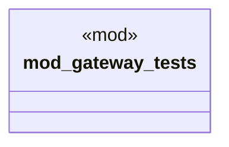

# `marketplace/packages/api-gateway-service-mesh/tests/gateway_tests.rs`

Source SHA-256: `7790f0eeaf099e0491d52e3821fa56926d2d9e4207bac7b98f3e592d58c7c663`

## Dependencies

- `std::sync::Arc`
- `std::time::Duration`
- `super::*`
- `tokio::sync::RwLock`

## Standing

- Structural parse: `ALIVE`
- Runtime behavior: `UNKNOWN`
