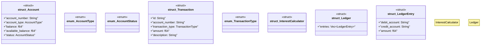

# `marketplace/packages/banking-core/src/rust/lib.rs`

Source SHA-256: `826fbf9b1483a6a7139fb9e4f146853b3018c3e244638787b751a64e81f764de`

## Dependencies

- `serde::{Deserialize, Serialize}`
- `std::collections::HashMap`

## Standing

- Structural parse: `ALIVE`
- Runtime behavior: `UNKNOWN`
