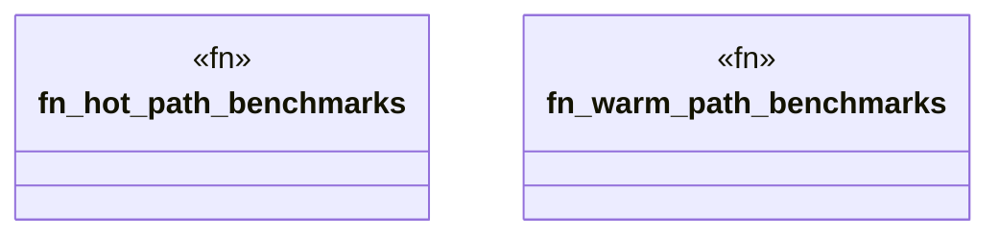

# `marketplace/packages/chatman-cli/benches/hot_path.rs`

Source SHA-256: `375a952e86b7853bdc343b8cd508eb40da18b18332f8ef31e891b56306939d0a`

## Dependencies

- `criterion::{black_box, criterion_group, criterion_main, Criterion, BenchmarkId}`
- `sha2::{Sha256, Digest}`
- `std::collections::HashMap`
- `std::time::Duration`

## Standing

- Structural parse: `ALIVE`
- Runtime behavior: `UNKNOWN`
