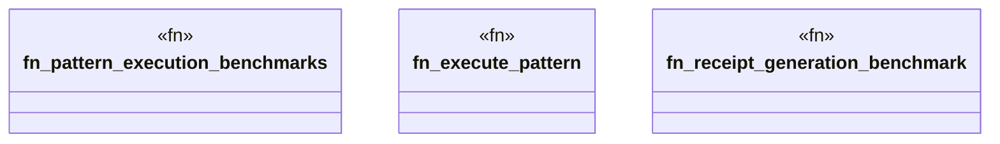

# `marketplace/packages/chatman-cli/benches/pattern_execution.rs`

Source SHA-256: `a4f881c061bc4b14dd4521a75a5ab5d1aa331fabb0b6ff775fab9c0bed814564`

## Dependencies

- `criterion::{black_box, criterion_group, criterion_main, Criterion, BenchmarkId}`
- `sha2::{Sha256, Digest}`
- `std::time::Duration`

## Standing

- Structural parse: `ALIVE`
- Runtime behavior: `UNKNOWN`
