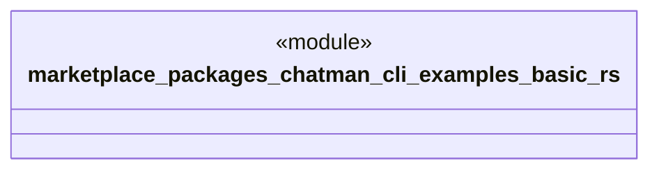

# `marketplace/packages/chatman-cli/examples/basic.rs`

Source SHA-256: `0b846ef86d4f9580aa93a80f50245433c578dc228076c07b321e5b654d612195`

## Dependencies

- `anyhow::Result`
- `chatman_cli::{ChatManager, Config, Message}`

## Standing

- Structural parse: `ALIVE`
- Runtime behavior: `UNKNOWN`
