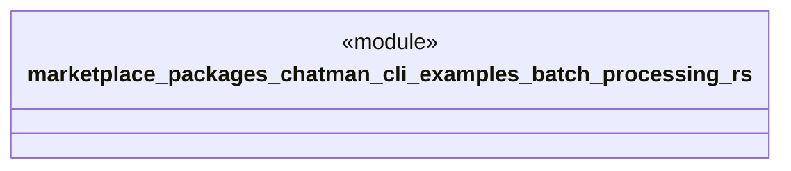

# `marketplace/packages/chatman-cli/examples/batch_processing.rs`

Source SHA-256: `0165888def45e08cb410c799ea3423b391a3839e27ed9b56848e4d994fb42c2a`

## Dependencies

- `anyhow::Result`
- `chatman_cli::{ChatManager, Config, Message}`

## Standing

- Structural parse: `ALIVE`
- Runtime behavior: `UNKNOWN`
