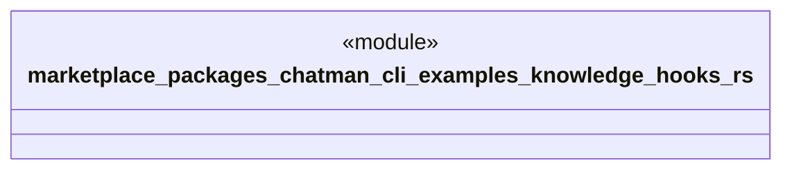

# `marketplace/packages/chatman-cli/examples/knowledge_hooks.rs`

Source SHA-256: `57bf404022e717d54c5ae63abc5a89644a857249fa0eeebd17b4906e795bc6e0`

## Dependencies

- `anyhow::Result`
- `chatman_cli::{ChatManager, Config, KnowledgeHook, Message}`

## Standing

- Structural parse: `ALIVE`
- Runtime behavior: `UNKNOWN`
