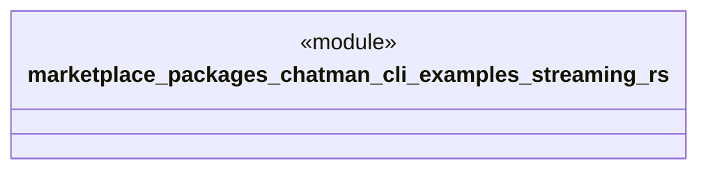

# `marketplace/packages/chatman-cli/examples/streaming.rs`

Source SHA-256: `38f65172b16f6234ea89fe9f2a4387c5c46fd9071616942b53a7b67fead05be5`

## Dependencies

- `anyhow::Result`
- `chatman_cli::{ChatManager, Config, Message}`

## Standing

- Structural parse: `ALIVE`
- Runtime behavior: `UNKNOWN`
