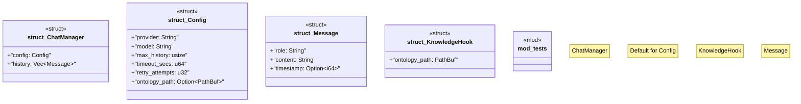

# `marketplace/packages/chatman-cli/src/lib.rs`

Source SHA-256: `bcdf7e423b7d1bea93c1421680c80c808f8a60218c4358c535155f050d11ff81`

## Dependencies

- `anyhow::{Context, Result}`
- `serde::{Deserialize, Serialize}`
- `std::path::PathBuf`
- `super::*`
- `tracing::{debug, info}`

## Standing

- Structural parse: `ALIVE`
- Runtime behavior: `UNKNOWN`
