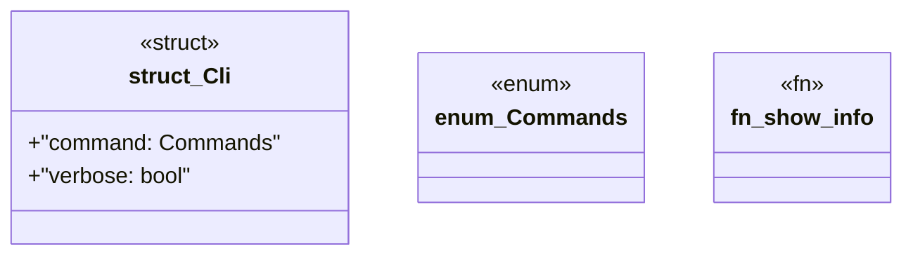

# `marketplace/packages/chatman-cli/src/main.rs`

Source SHA-256: `ac196025192f761972d04342311886a809967ef0b2ea3d79fe7d348e6e08a202`

## Dependencies

- `anyhow::Result`
- `chatman_cli::{ChatManager, Config, Message}`
- `clap::{Parser, Subcommand}`
- `colored::*`
- `dialoguer::{Input, Confirm}`
- `std::path::PathBuf`

## Standing

- Structural parse: `ALIVE`
- Runtime behavior: `UNKNOWN`
