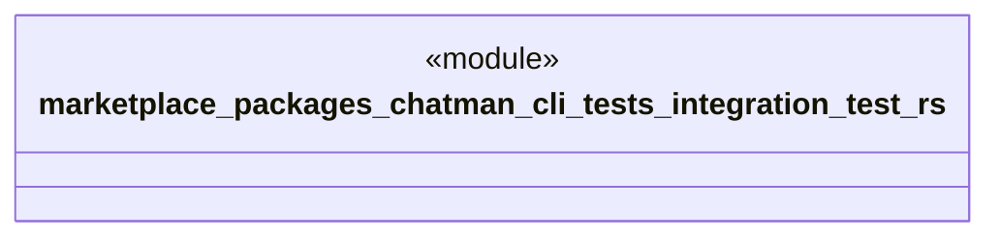

# `marketplace/packages/chatman-cli/tests/integration_test.rs`

Source SHA-256: `5ab4bd7a5630f9c240d0c7aa9fdd5613bdac21077e8e69b331c61b2c13173ab7`

## Dependencies

- `anyhow::Result`
- `chatman_cli::{ChatManager, Config, Message}`

## Standing

- Structural parse: `ALIVE`
- Runtime behavior: `UNKNOWN`
