# `marketplace/packages/compliance-audit-system/src/rust/lib.rs`

Source SHA-256: `4a09eefb1980c7bd4614fed7fcc91b8379fefd8d7c3d5f4672055e72e1916b13`

```mermaid
classDiagram
    class enum_ComplianceFramework {
      <<enum>>
    }
    class enum_EventType {
      <<enum>>
    }
    class enum_Severity {
      <<enum>>
    }
    class struct_AuditEvent {
      <<struct>>
      +"event_id: String"
      +"event_type: EventType"
      +"timestamp: DateTime~Utc~"
      +"actor: String"
      +"action: String"
      +"resource: String"
      +"outcome: String"
      +"ip_address: Option~String~"
      +"user_agent: Option~String~"
      +"metadata: HashMap~String"
    }
    class struct_Policy {
      <<struct>>
      +"policy_id: String"
      +"policy_name: String"
      +"framework: ComplianceFramework"
      +"version: String"
      +"effective_date: DateTime~Utc~"
      +"expiration_date: Option~DateTime~Utc~~"
      +"retention_period_days: Option~u32~"
    }
    class struct_PolicyViolation {
      <<struct>>
      +"violation_id: String"
      +"policy_id: String"
      +"event_id: String"
      +"severity: Severity"
      +"detected_at: DateTime~Utc~"
      +"resolved_at: Option~DateTime~Utc~~"
      +"description: String"
    }
    class struct_ComplianceIncident {
      <<struct>>
      +"incident_id: String"
      +"incident_type: String"
      +"severity: Severity"
      +"discovered_at: DateTime~Utc~"
      +"resolved_at: Option~DateTime~Utc~~"
      +"affected_records: Option~u64~"
      +"description: String"
      +"remediation: Option~String~"
    }
    class struct_AccessReview {
      <<struct>>
      +"review_id: String"
      +"review_type: String"
      +"due_date: DateTime~Utc~"
      +"completion_date: Option~DateTime~Utc~~"
      +"reviewer: String"
      +"status: String"
      +"items: Vec~String~"
    }
    class struct_Evidence {
      <<struct>>
      +"evidence_id: String"
      +"evidence_type: String"
      +"collected_at: DateTime~Utc~"
      +"collected_by: String"
      +"hash: String"
      +"metadata: HashMap~String"
    }
    class struct_ComplianceAuditSystem {
      <<struct>>
      +"events: Vec~AuditEvent~"
      +"policies: HashMap~String"
      +"violations: Vec~PolicyViolation~"
      +"incidents: Vec~ComplianceIncident~"
    }
    class mod_tests {
      <<mod>>
    }
    note "AuditEvent"
    note "ComplianceAuditSystem"
```

## Dependencies

- `chrono::{DateTime, Utc, Duration}`
- `serde::{Deserialize, Serialize}`
- `std::collections::HashMap`
- `super::*`

## Standing

- Structural parse: `ALIVE`
- Runtime behavior: `UNKNOWN`
