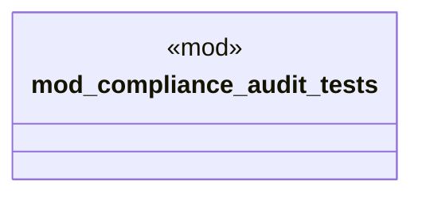

# `marketplace/packages/compliance-audit-system/tests/chicago_tdd.rs`

Source SHA-256: `a6cb96a43e56510e58d9d421b59cefa5adae25b76263742dbc7ee30108068d28`

## Dependencies

- `std::time::Instant`

## Standing

- Structural parse: `ALIVE`
- Runtime behavior: `UNKNOWN`
