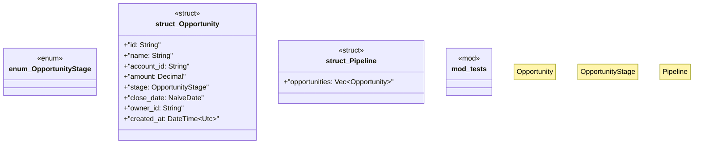

# `marketplace/packages/crm-customer-management/templates/rust/crm_backend.rs`

Source SHA-256: `f4d4eb7bdf28a40dde8821f7a18c577184b1916223c8575e7ef852c3e31831bf`

## Dependencies

- `chrono::{DateTime, Utc, NaiveDate}`
- `rust_decimal::Decimal`
- `serde::{Deserialize, Serialize}`
- `super::*`

## Standing

- Structural parse: `ALIVE`
- Runtime behavior: `UNKNOWN`
