# `marketplace/packages/cryptocurrency-exchange/src/rust/lib.rs`

Source SHA-256: `8f8ac7ef2494a4342693eb639c7f63ae41fdbbe87dec769f5f24dc3209438276`

```mermaid
classDiagram
    class struct_Wallet {
      <<struct>>
      +"address: String"
      +"wallet_type: WalletType"
      +"balances: HashMap~String"
      +"created_at: DateTime~Utc~"
    }
    class enum_WalletType {
      <<enum>>
    }
    class struct_Order {
      <<struct>>
      +"id: String"
      +"user_id: String"
      +"order_type: OrderType"
      +"side: OrderSide"
      +"pair: String"
      +"price: f64"
      +"quantity: f64"
      +"status: OrderStatus"
      +"created_at: DateTime~Utc~"
    }
    class enum_OrderType {
      <<enum>>
    }
    class enum_OrderSide {
      <<enum>>
    }
    class enum_OrderStatus {
      <<enum>>
    }
    class struct_Trade {
      <<struct>>
      +"id: String"
      +"buy_order_id: String"
      +"sell_order_id: String"
      +"price: f64"
      +"quantity: f64"
      +"fee: f64"
      +"executed_at: DateTime~Utc~"
    }
    class struct_LiquidityPool {
      <<struct>>
      +"id: String"
      +"token_a: String"
      +"token_b: String"
      +"reserve_a: f64"
      +"reserve_b: f64"
      +"total_liquidity: f64"
      +"apy: f64"
    }
    class struct_OrderBook {
      <<struct>>
      +"bids: Vec~Order~"
      +"asks: Vec~Order~"
    }
    class struct_WalletManager {
      <<struct>>
      +"wallets: HashMap~String"
    }
    class mod_tests {
      <<mod>>
    }
    note "LiquidityPool"
    note "OrderBook"
    note "WalletManager"
```

## Dependencies

- `chrono::{DateTime, Utc}`
- `serde::{Deserialize, Serialize}`
- `std::collections::HashMap`
- `super::*`

## Standing

- Structural parse: `ALIVE`
- Runtime behavior: `UNKNOWN`
