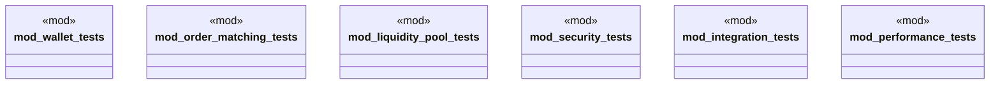

# `marketplace/packages/cryptocurrency-exchange/tests/exchange_tests.rs`

Source SHA-256: `2c1f5a6a0c333d8c72ebff6bac95238a204cb220ff1f2f6e8f2a7f724270942e`

## Dependencies

- `super::super::*`

## Standing

- Structural parse: `ALIVE`
- Runtime behavior: `UNKNOWN`
