# `marketplace/packages/customer-loyalty-rewards/templates/rust/points_engine.rs`

Source SHA-256: `06d9396886f0e73c1027c56fe929485269202ee1645e0147040533ef53f30ab3`

```mermaid
classDiagram
    class enum_Tier {
      <<enum>>
    }
    class struct_Member {
      <<struct>>
      +"member_id: String"
      +"tier: Tier"
      +"points_balance: i32"
      +"lifetime_points: i32"
      +"enrollment_date: DateTime~Utc~"
    }
    class struct_PointsTransaction {
      <<struct>>
      +"transaction_id: String"
      +"member_id: String"
      +"points: i32"
      +"transaction_type: TransactionType"
      +"timestamp: DateTime~Utc~"
      +"description: String"
    }
    class enum_TransactionType {
      <<enum>>
    }
    class struct_PointsEngine {
      <<struct>>
      +"points_per_dollar: f64"
      +"referral_points: i32"
      +"review_points: i32"
      +"birthday_bonus: i32"
    }
    class struct_Reward {
      <<struct>>
      +"reward_id: String"
      +"name: String"
      +"points_cost: i32"
      +"reward_type: RewardType"
    }
    class enum_RewardType {
      <<enum>>
    }
    class struct_RewardsCatalog {
      <<struct>>
      +"rewards: HashMap~String"
    }
    class struct_Badge {
      <<struct>>
      +"badge_id: String"
      +"name: String"
      +"description: String"
      +"icon: String"
    }
    class struct_Streak {
      <<struct>>
      +"streak_type: String"
      +"count: i32"
      +"last_activity: DateTime~Utc~"
    }
    class mod_tests {
      <<mod>>
    }
    note "PointsEngine"
    note "RewardsCatalog"
    note "Streak"
    note "Tier"
```

## Dependencies

- `chrono::{DateTime, Utc, Duration}`
- `serde::{Deserialize, Serialize}`
- `std::collections::HashMap`
- `super::*`

## Standing

- Structural parse: `ALIVE`
- Runtime behavior: `UNKNOWN`
