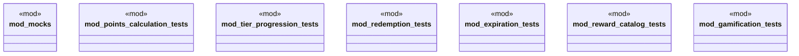

# `marketplace/packages/customer-loyalty-rewards/tests/chicago_tdd/loyalty_tests.rs`

Source SHA-256: `a74151fb6e34ee5c488c32365ac57b45c9167122f05aaa08785392c3ec961651`

## Dependencies

- `mocks::*`
- `std::collections::HashMap`
- `super::*`

## Standing

- Structural parse: `ALIVE`
- Runtime behavior: `UNKNOWN`
