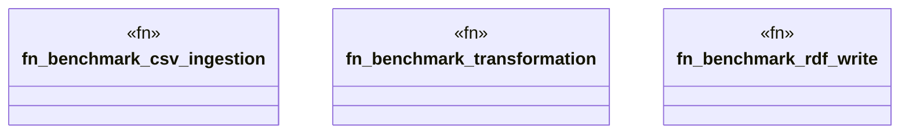

# `marketplace/packages/data-pipeline-cli/benches/pipeline_benchmark.rs`

Source SHA-256: `8743fbb82f48627f78a1c3cff6db3236bd96b5763556613798fe956aee8063c3`

## Dependencies

- `criterion::{black_box, criterion_group, criterion_main, Criterion}`
- `data_pipeline_cli::{Pipeline, Source, Transform, Sink}`

## Standing

- Structural parse: `ALIVE`
- Runtime behavior: `UNKNOWN`
