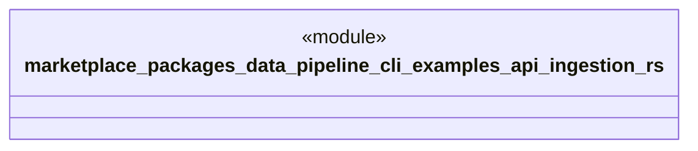

# `marketplace/packages/data-pipeline-cli/examples/api_ingestion.rs`

Source SHA-256: `1363d044a8c5f09afd6e5b36872a1e5f152a57c85105a49e4a8d3d4970ad16f5`

## Dependencies

- `anyhow::Result`
- `data_pipeline_cli::{Pipeline, Source, Transform, Sink}`

## Standing

- Structural parse: `ALIVE`
- Runtime behavior: `UNKNOWN`
