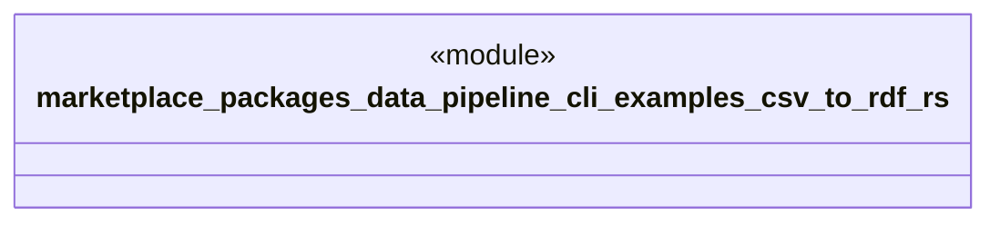

# `marketplace/packages/data-pipeline-cli/examples/csv_to_rdf.rs`

Source SHA-256: `0abff7c3458746b1220c6f957304d8615805ee589c42a9c05d44d5ae3706327d`

## Dependencies

- `anyhow::Result`
- `data_pipeline_cli::{Pipeline, Source, Transform, Sink}`

## Standing

- Structural parse: `ALIVE`
- Runtime behavior: `UNKNOWN`
