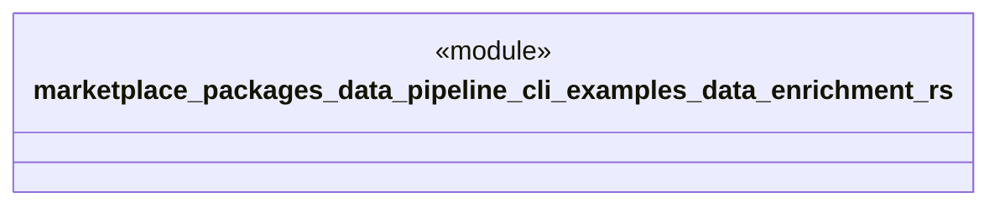

# `marketplace/packages/data-pipeline-cli/examples/data_enrichment.rs`

Source SHA-256: `7cb219c182a6de049e6b00d0435bb4d77c2339d731c39cb281c14364e078b5e2`

## Dependencies

- `anyhow::Result`
- `data_pipeline_cli::{Pipeline, Source, Transform, Sink}`

## Standing

- Structural parse: `ALIVE`
- Runtime behavior: `UNKNOWN`
