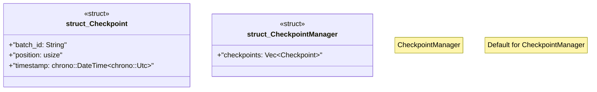

# `marketplace/packages/data-pipeline-cli/src/checkpoint.rs`

Source SHA-256: `e886ec3e6da65db17b5c165787f893fec25dc18b7a385d58361888df19f66c4f`

## Dependencies

- `serde::{Deserialize, Serialize}`

## Standing

- Structural parse: `ALIVE`
- Runtime behavior: `UNKNOWN`
