# `marketplace/packages/data-pipeline-cli/src/lib.rs`

Source SHA-256: `23e43f44427ddee78eb6e4463c4bcad621b698c55e80360b5f74eec8367d1621`

```mermaid
classDiagram
    class mod_pipeline {
      <<mod>>
    }
    class mod_source {
      <<mod>>
    }
    class mod_transform {
      <<mod>>
    }
    class mod_sink {
      <<mod>>
    }
    class mod_scheduler {
      <<mod>>
    }
    class mod_metrics {
      <<mod>>
    }
    class mod_checkpoint {
      <<mod>>
    }
    class struct_Record {
      <<struct>>
      +"fields: HashMap~String"
    }
    class enum_Value {
      <<enum>>
    }
    class struct_Batch {
      <<struct>>
      +"records: Vec~Record~"
      +"metadata: BatchMetadata"
    }
    class struct_BatchMetadata {
      <<struct>>
      +"batch_id: String"
      +"source: String"
      +"timestamp: chrono::DateTime~chrono::Utc~"
      +"record_count: usize"
    }
    class trait_DataSource {
      <<trait>>
      +"initialize(&mut self) -~ anyhow::Result~()~"
      +"extract_batch(&mut self, batch_size: usize) -~ anyhow::Result~Option~Batch~~"
      +"schema(&self) -~ anyhow::Result~Schema~"
      +"test_connection(&self) -~ anyhow::Result~bool~"
      +"close(&mut self) -~ anyhow::Result~()~"
    }
    class trait_DataTransform {
      <<trait>>
      +"transform(&self, batch: Batch) -~ anyhow::Result~Batch~"
      +"validate(&self) -~ anyhow::Result~()~"
    }
    class trait_DataSink {
      <<trait>>
      +"initialize(&mut self) -~ anyhow::Result~()~"
      +"write_batch(&mut self, batch: Batch) -~ anyhow::Result~()~"
      +"flush(&mut self) -~ anyhow::Result~()~"
      +"test_connection(&self) -~ anyhow::Result~bool~"
      +"close(&mut self) -~ anyhow::Result~()~"
    }
    class struct_Schema {
      <<struct>>
      +"fields: Vec~Field~"
    }
    class struct_Field {
      <<struct>>
      +"name: String"
      +"field_type: FieldType"
      +"nullable: bool"
    }
    class enum_FieldType {
      <<enum>>
    }
    class enum_PipelineError {
      <<enum>>
    }
    class mod_tests {
      <<mod>>
    }
```

## Dependencies

- `async_trait::async_trait`
- `checkpoint::{Checkpoint, CheckpointManager}`
- `metrics::{Metrics, MetricsCollector}`
- `pipeline::{Pipeline, PipelineBuilder, PipelineConfig}`
- `scheduler::{Scheduler, ScheduleType}`
- `serde::{Deserialize, Serialize}`
- `sink::{Sink, SinkType, SinkConfig}`
- `source::{Source, SourceType, SourceConfig}`
- `std::collections::HashMap`
- `super::*`
- `transform::{Transform, TransformType, TransformConfig}`

## Standing

- Structural parse: `ALIVE`
- Runtime behavior: `UNKNOWN`
