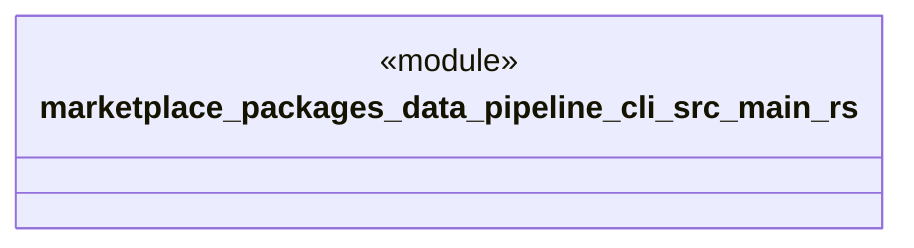

# `marketplace/packages/data-pipeline-cli/src/main.rs`

Source SHA-256: `fac967f178c32b9de8d018c2620d2db3dbe90755c53f7f0f3143e8dbb642924b`

## Dependencies

- `anyhow::Result`
- `clap_noun_verb::ClapNounVerb`

## Standing

- Structural parse: `ALIVE`
- Runtime behavior: `UNKNOWN`
