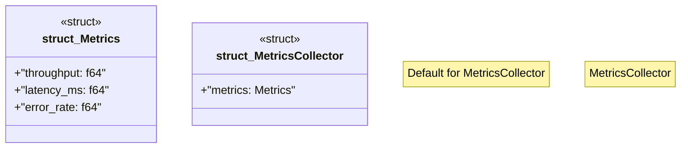

# `marketplace/packages/data-pipeline-cli/src/metrics.rs`

Source SHA-256: `7d6aaede8ace5d1868be73d41211bcfcb257b7603c43849fb510b66ab6c382e4`

## Dependencies

- `serde::{Deserialize, Serialize}`

## Standing

- Structural parse: `ALIVE`
- Runtime behavior: `UNKNOWN`
