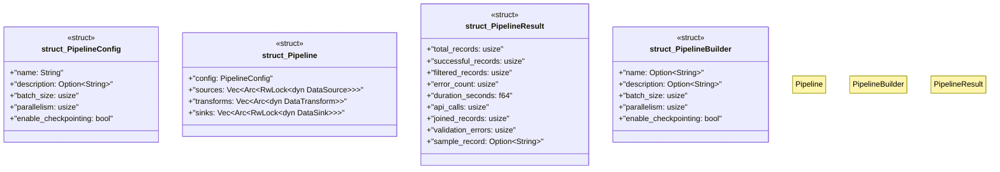

# `marketplace/packages/data-pipeline-cli/src/pipeline.rs`

Source SHA-256: `f6f7907e941492ecde960ea31f140cd0d29d3872e7e7ba45bfd136355b39c4e3`

## Dependencies

- `anyhow::Result`
- `crate::{DataSource, DataTransform, DataSink, Batch, PipelineError}`
- `serde::{Deserialize, Serialize}`
- `std::sync::Arc`
- `tokio::sync::RwLock`

## Standing

- Structural parse: `ALIVE`
- Runtime behavior: `UNKNOWN`
