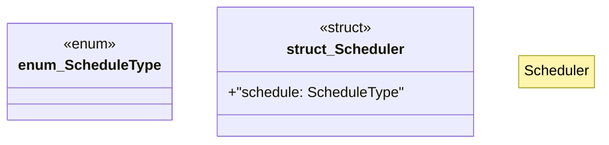

# `marketplace/packages/data-pipeline-cli/src/scheduler.rs`

Source SHA-256: `47fdd50fde0d079f38bfd29bd38fd651ead19a6e8a3d95f79caa96f2a497ce81`

## Dependencies

- `serde::{Deserialize, Serialize}`

## Standing

- Structural parse: `ALIVE`
- Runtime behavior: `UNKNOWN`
