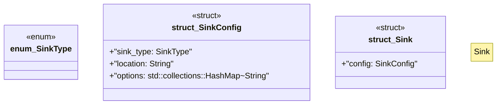

# `marketplace/packages/data-pipeline-cli/src/sink.rs`

Source SHA-256: `11693dc823641010220a3f9402f250b8ae0802cb4f47097fafe48646370add05`

## Dependencies

- `anyhow::Result`
- `serde::{Deserialize, Serialize}`

## Standing

- Structural parse: `ALIVE`
- Runtime behavior: `UNKNOWN`
