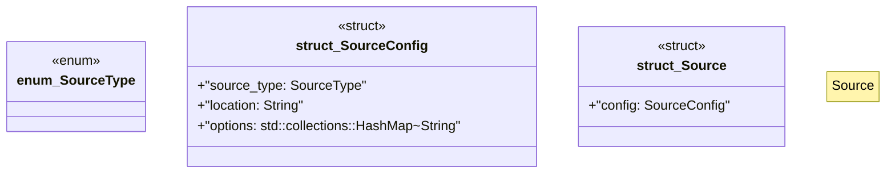

# `marketplace/packages/data-pipeline-cli/src/source.rs`

Source SHA-256: `16ddd54b656d8a87dd35298d654d4024a6569f17bac6ac313b02c410084bd80e`

## Dependencies

- `anyhow::Result`
- `serde::{Deserialize, Serialize}`

## Standing

- Structural parse: `ALIVE`
- Runtime behavior: `UNKNOWN`
