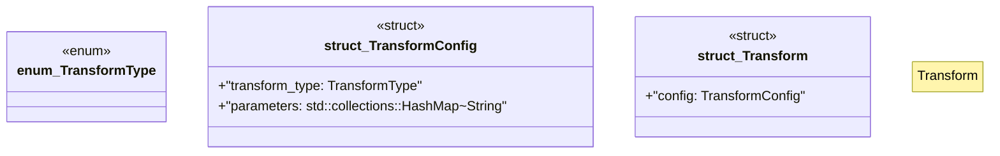

# `marketplace/packages/data-pipeline-cli/src/transform.rs`

Source SHA-256: `16ca449c50ad82b73a18c166064eee9515b478532b118be34b540c91420337c5`

## Dependencies

- `anyhow::Result`
- `serde::{Deserialize, Serialize}`

## Standing

- Structural parse: `ALIVE`
- Runtime behavior: `UNKNOWN`
