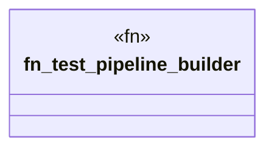

# `marketplace/packages/data-pipeline-cli/tests/integration_test.rs`

Source SHA-256: `9be82b51557e0b07fa963647be21b6321f313e18b1f0d68f6d7d8ef978e84f33`

## Dependencies

- `data_pipeline_cli::{Pipeline, Source, Transform, Sink}`
- `tempfile::TempDir`

## Standing

- Structural parse: `ALIVE`
- Runtime behavior: `UNKNOWN`
