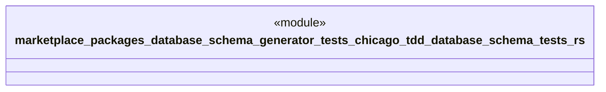

# `marketplace/packages/database-schema-generator/tests/chicago_tdd/database_schema_tests.rs`

Source SHA-256: `decb741f900956cbace213cd71d1a60d9fbeb743e7cb73de572bd7ff64228936`

## Dependencies

- `sqlx::{PgPool, Row}`
- `std::time::Instant`
- `testcontainers::{clients::Cli, images::postgres::Postgres, Container}`

## Standing

- Structural parse: `ALIVE`
- Runtime behavior: `UNKNOWN`
